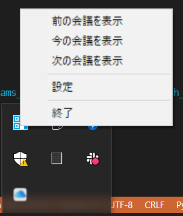
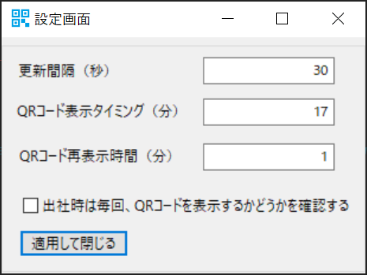

# Teams_Meeting_QRcode_Generator_with_Outlook
Outlook の予定表から Teams Meeting のゲスト参加用 QRcode を作成し、会議開始前に画面にQRコードを表示します。

在宅勤務時はゲスト参加が推奨されている方には便利なツールになっていると思います。

常駐アプリですので、一度起動するとバックグラウンドで処理が実行されます。
PCの立ち上げと同時にこのアプリを起動するように設定すると便利です。

## 機能
- Outlook から予定表を取得し、Teams 会議の開始数分前にゲスト参加用のQRコードを画面上に表示する
- 作業端末にリモートデスクトップ接続（在宅勤務時）かコンソール接続（出社時）を判別し、QRコードの表示/非表示を切り替える（Windows Home Edition では無効）

予定表の更新感覚やQRコード表示タイミング、出社時のQRコード表示確認の有無は設定画面から変更可能です。

## EXEファイルの作成
`pyinstaller` を用いることで簡単に EXE ファイルを作成することができます。

### 1. レポジトリをクローンし、移動する
```shell
$ git clone https://github.com/taku-kaneko/Teams_Meeting_QRcode_Generator_with_Outlook.git
$ cd Teams_QRcode_Generator_with_Outlook
```

### 2. pyinstaller で EXE ファイルを作成する
下記のコマンドを実行することで、`dist` フォルダ内に `TeamsQRcoder.exe` が作成される
```shell
$ pyinstaller app.py --onefile --noconsole --icon=icon\icon.ico
$ pyinstaller TeamsQRcoder.spec
```

作成された `TeamsQRcoder.exe` を下記のフォルダにコピーすると、次回 PC 立ち上げ時に自動的にアプリが起動します。

```
C:\Users\%USERNAME%\AppData\Roaming\Microsoft\Windows\Start Menu\Programs\Startup
```

## 使い方
操作は特に不要で、`TeamsQRcoder.exe` を実行すると自動的に Outlook の予定表の取得を行い、Teams 会議開始 5分前になったら画面上に以下のように QR コードが表示されます。


デフォルトでは、約1分間隔で Outlook の予定表を取得し、Teams 会議の更新を行います。
また、QR コードの表示タイミングは会議開始 5分前に設定されます。
この設定は設定画面から変更可能です。
設定画面は、タスクトレイにあるアイコンを左クリックし、表示されたメニューから `設定` をクリックすると表示されます。
また、タスクトレイのメニューから QR コードを表示させることもできます。





## 開発環境
- Windows 10 Home Edition (19043.1237) and Windows 10 Professional
- Python 3.9.6
- pandas==1.3.3
- pywin32==301
- wxPython==4.1.1
- qrcode==7.3

## ライセンス
MIT License

Copyright (c) 2021 Takumi Kaneko

Permission is hereby granted, free of charge, to any person obtaining a copy
of this software and associated documentation files (the "Software"), to deal
in the Software without restriction, including without limitation the rights
to use, copy, modify, merge, publish, distribute, sublicense, and/or sell
copies of the Software, and to permit persons to whom the Software is
furnished to do so, subject to the following conditions:

The above copyright notice and this permission notice shall be included in all
copies or substantial portions of the Software.

THE SOFTWARE IS PROVIDED "AS IS", WITHOUT WARRANTY OF ANY KIND, EXPRESS OR
IMPLIED, INCLUDING BUT NOT LIMITED TO THE WARRANTIES OF MERCHANTABILITY,
FITNESS FOR A PARTICULAR PURPOSE AND NONINFRINGEMENT. IN NO EVENT SHALL THE
AUTHORS OR COPYRIGHT HOLDERS BE LIABLE FOR ANY CLAIM, DAMAGES OR OTHER
LIABILITY, WHETHER IN AN ACTION OF CONTRACT, TORT OR OTHERWISE, ARISING FROM,
OUT OF OR IN CONNECTION WITH THE SOFTWARE OR THE USE OR OTHER DEALINGS IN THE
SOFTWARE.